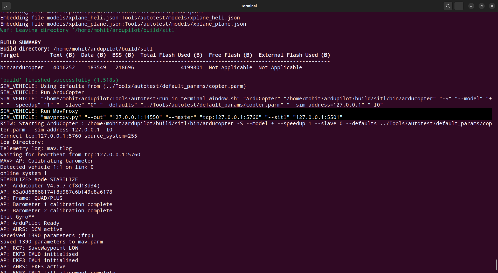

# VI_ASSIGNMENT
Solutions for VI Assignment for PS1 & PS2.

## Pre-requisites
- Ubuntu-22.04 LTS Desktop
- ArduPilot-SITL
- Python3.10

## Setup instructions for PS-2
I'm using ArduPilot SITL to simulate the drone environment and Dronekit to send commands to the drone which is based on MAVLink (Pymavlink).

- Clone ardupilot repo 
```
cd ~
git clone https://github.com/ArduPilot/ardupilot.git
```
- Install dependencies for your system
```
cd ~/ardupilot
Tools/environment_install/install-prereqs-ubuntu.sh -y
```

- Checkout to latest Copter Build & update the modules
```
cd ~/ardupilot
. ~/.profile
git checkout Copter-4.5
git submodule update --init --recursive
```

- Run the SITL (Making sure you are in ArduCopter direc)
```
cd ~/ardupilot/ArduCopter
sim_vehicle.py -v ArduCopter
```
***NOTE:***
- In case you get errors like `sim_vehicle.py : command not found`, then run this command :
```
echo "export PATH=$PATH:$HOME/ardupilot/Tools/autotest:$HOME/.local/bin" >> ~/.bashrc
```

- Allowing multiple UDP out ports for SITL:    

    - By default the Copter-4.5 build out at only 1 udp port for connection.
    
    - You can check this by running this command:    
        ```
        sim_vehicle.py -v ArduCopter
        ```
        and if see the selected content of the log data, you can see there is only 1 --out udp port

        <div align="center">
        
        </div>
    
    - You can use this out port to connect direcltly to the SITL using Pymavlink(low level) script.
    
    - But to connect your dronekit library, you need add one more udp out port.
    
    - To do this, go to `ardupilot/Tools/autotest/sime_vehicle.py` and comment line no. *883* from this    

        ```python
        ports = [14550 + 10 * i]
        ``` 
        and use this inplace of that
        ```python
        ports = [p + 10 * i for p in [14550, 14551]]
        ```
    - Now if you run the sitl, you will see 2 --out udp ports

        <div align="center">
        
        </div>


## Running PS-2 solution

- Clone this repo in your system:
```
cd ~
git clone https://github.com/ab31mohit/VI_ASSIGNMENT.git
```
- Start the SITL (with MAVProxy console & map) in terminal:
```
sim_vehicle.py -v ArduCopter --console --map
```
Wait until the log data on MAVProxy console shows `EKF is using GPS` or something similar.    

Btw you can change the default SITL map location to anything you want to (make sure that location has enough open space). Follow this link for more info - [change default sitl location](https://ardupilot.org/dev/docs/using-sitl-for-ardupilot-testing.html#setting-vehicle-start-location:~:text=Setting%20vehicle%20start,locations.txt%0Afile).

- Now run the script to upload First mission (of 15 waypoints) to drone in another terminal:
```
cd ~/VI_ASSIGNMENT/drone_missions/
python3 mission.py
```
Here's an output video for the same 

https://github.com/user-attachments/assets/10e966bc-033d-4b06-ba05-78162f43f041


## Running PS-1 solution

- Directory structure of *grid_path_planning*
```
grid_path_planning/
│
├──── path_planning.cpp   # actual algorithm that solves for shortest path while minimizing cost
│  
├──── output.txt   # data of n X n X n points grid with each row defining the point and a weight(or cost)
│
├──── points.txt  # set of start and end points separated by an empty row
|
├──── paths.txt  # solution showing total cost, order in which paths should be traversed and path
|
```

- Go to the path of `path_planning.cpp` file. Compile & run it
```
cd ~/VI_ASSIGNMENT/grid_path_planning
g++ path_planning.cpp -o path_planning && ./path_planning && rm path_planning
```
(Make sure you have already created three texts files named `output.txt`, `paths.txt`, `points.txt`)
